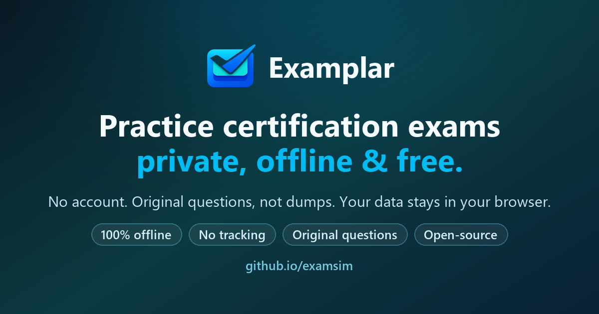

# Examplar

<p align="center">
  <a href="https://examplar.app/">
    
  </a>
</p>

Examplar is an open-source, local-first certification exam simulator. Practice
in the browser with original questions, hands-on labs, and detailed review tools.
This repository is the standalone local edition: no account is required, and your progress stays on your device.

**[Try Examplar](https://examplar.app/)** ·
**[Browse practice exams](https://examplar.app/exams/)** ·
**[Read the privacy model](PRIVACY-AND-STORAGE.md)**

> If Examplar helps you study or gives you ideas for your own local-first app,
> consider starring the repository. It helps other learners and contributors
> discover the project.

## Why Examplar

- **Start immediately:** open a free preview without creating an account
- **Practice realistically:** timed sessions, multiple question types, and
  configurable pass scores
- **Learn from mistakes:** detailed review, weak-area practice, and spaced
  repetition
- **Keep control of your data:** progress and imported content remain in browser
  storage
- **Study anywhere:** install it as a PWA and continue offline after the app is
  cached
- **Use trustworthy material:** original educational questions based on public
  exam objectives, not dumps

The current library covers Microsoft Azure, Azure AI, Copilot Studio, Microsoft
Fabric, AWS, and CompTIA certifications. You can also import or create your own
packs.

## What It Provides

- Timed exam sessions with configurable pass scores
- Standard, multi-select, sequence, drag-select, and Yes/No matrix questions
- Study Mode with spaced repetition and weak-area practice
- Attempt history, detailed review, and progress export
- JSON and ZIP pack import
- A browser-based question editor
- Local image support
- Light and dark themes
- Installable PWA behavior and offline access after the app is cached

No account is required.

## Local Edition and Online Exams

The free packs, editor, personal JSON/ZIP imports, and local progress work without
an Examplar account. Local use does not send analytics. Keep the downloaded app
and packs to practise independently of the hosted service.

The **View complete exam online** links lead to the separate paid service at
`https://examplar.app/exams/<exam-id>/`, where current prices and access conditions
are maintained. New purchases require an account and internet connection. They
do not include an offline download, and the personal online licence does not
decrypt or activate a pack in this repository.

Previous offline purchases still work: use **Import previous offline pack** in
the exam information modal, or the normal file import, and enter the original
pack decryption key when prompted. Do not enter a new online licence there.

The hosted service has its own account, licensing, and storage policy. The local
storage descriptions below apply to this repository's simulator.

## Privacy Model

Questions, selected answers, imported content, images, progress, and editor
changes remain in browser storage.

When this local edition is deployed on an approved public host, it sends limited product telemetry to Azure
Application Insights. This includes page views, coarse usage events, campaign
labels, referrer hostname, online-exam link clicks, and Azure-derived coarse client/location metadata. Online link clicks do not mean a purchase or activation occurred.
Analytics can be disabled from the Privacy settings control.

Analytics is not initialized on `localhost`, private self-hosted URLs, or
`file://` URLs.

See [PRIVACY-AND-STORAGE.md](PRIVACY-AND-STORAGE.md) for the complete disclosure.

## Quick Start

### Public Site

Open [examplar.app](https://examplar.app), select an exam, and start practicing.
The hosted service offers free practice and account-based complete exams.
Use the local edition below for independent offline practice.

### Local Server

```powershell
git clone https://github.com/rmssantos/examsim.git
cd examsim
python server.py
```

Open `http://localhost:8000`.

The local server enables automatic pack discovery and the editor's local image
upload endpoint. It binds to the loopback interface by default.

### Direct File Use

Opening `index.html` directly can work for basic use, but browser security rules
limit automatic folder discovery and some image workflows. ZIP import is
intentionally unavailable under `file://` because extraction runs in an isolated
Web Worker; run `python server.py` and open `http://localhost:8000` for ZIP packs.
JSON import and basic practice can still work in direct-file mode.

## Exam Packs

Public packs live under:

`user-content/exams/<exam-id>/`

Each directory contains the required question-data JSON, pack metadata, an
integrity manifest, and optional images. The
[question and metadata schema](docs/Pack-Format.md) defines the exact filenames
and structure.

Users can also import:

- a JSON question array;
- a combined JSON object containing `id`, `metadata`, and `questions`;
- a ZIP containing the required question-data JSON, optional metadata, and
  optional images.

ZIP import requires the public HTTPS site or the supported local HTTP server. It
does not run when `index.html` is opened directly as a `file://` URL.

Imported packs and their progress are stored in that browser profile. They are
not uploaded to the public repository or server.

Detailed formats:

- [Exam import guide](user-content/README-IMPORT.md)
- [Question and metadata schema](docs/Pack-Format.md)
- [Pack distribution guide](docs/HOW-TO-DISTRIBUTE.md)

## Built-In Editor

Open `editor.html` to create or edit a pack.

The editor can:

- add and update supported question types;
- edit pack metadata;
- import and export JSON;
- preview questions;
- copy image files into a local pack when running through `server.py`.

Browser edits affect only the current browser. To publish a correction, export
the updated content and submit a pull request or GitHub issue.

## Repository Layout

```text
.
|-- index.html                 Homepage and exam library
|-- exam.html                  Exam and Study Mode runtime
|-- editor.html                Question editor
|-- privacy-and-storage.html   User-facing privacy page
|-- server.py                  Optional local HTTP server
|-- assets/                    CSS, JavaScript, media, and vendored dependencies
|-- exams/                     Generated SEO landing pages
|-- tools/                     Generators, validators, and pack utilities
|-- tests/                     Python and browser regression tests
|-- docs/                      Public technical documentation
`-- user-content/exams/        Intentionally published exam packs
```

## Content Policy

This repository contains original educational practice content. It must not
contain:

- copied live exam questions or unauthorized assessment collections;
- proprietary packs without redistribution rights;
- private paid-pack sources or delivery artifacts;
- license keys, buyer data, analytics exports, or internal commercial records;
- personal browser data or local development notes.

Local/private material belongs outside Git history. The repository ignores
`.local/` for that purpose.

Examplar is not affiliated with or endorsed by Microsoft, Amazon Web Services,
or other certification vendors. Certification names and trademarks belong to
their respective owners.

## Development

Requirements:

- Python 3.10 or newer
- Node.js 22 or newer

Install browser test dependencies:

```powershell
npm ci
```

Run validation:

```powershell
python tools/validate-exam-packs.py --root user-content/exams
python tools/validate-exam-packs.py --root user-content/exams --check-manifest
python -m unittest discover -s tests -p "test_*.py"
node --check service-worker.js
```

Run the browser smoke test with a local static server:

```powershell
python -m http.server 4173 --bind 127.0.0.1
npm run test:browser
```

Generated exam pages must stay synchronized with metadata:

```powershell
python tools/generate-exam-pages.py
```

See [CONTRIBUTING.md](CONTRIBUTING.md) before opening a pull request.

## Security

Treat imported JSON, ZIP files, metadata, filenames, URLs, and browser storage
as untrusted input. Security issues should be reported without attaching
proprietary packs, credentials, or personal data.

Production response-header guidance is documented in
[docs/SECURITY-HEADERS.md](docs/SECURITY-HEADERS.md).

## License

The simulator source is available under the [MIT License](LICENSE). Authored
practice questions, explanations, lab guides, editorial metadata, and original
branded media follow the separate [Examplar content terms](CONTENT-LICENSE.md).
Third-party assets retain their own terms.
